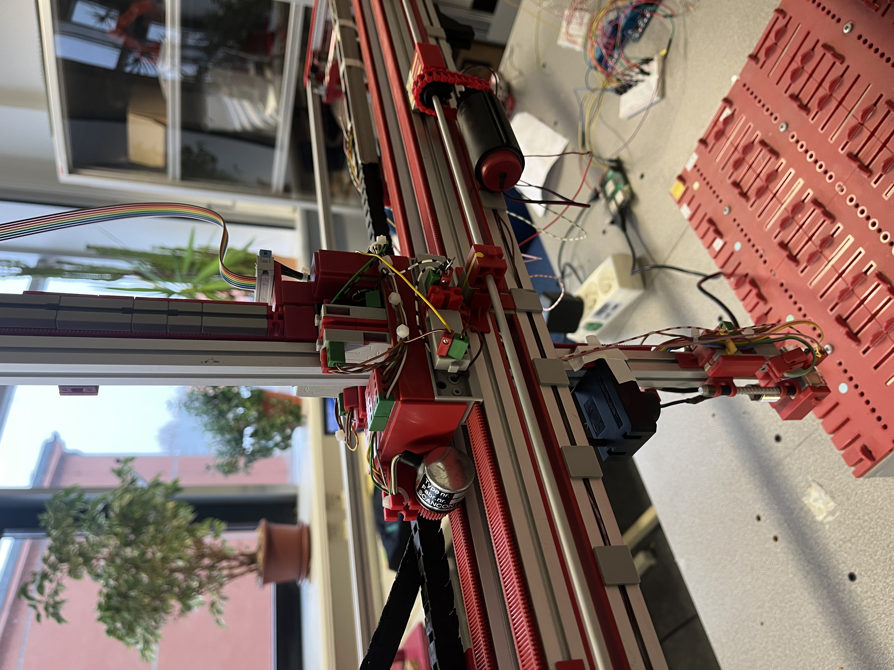

 Fischertechnik Pick-and-Place 3D Robot

This project contains the code and configuration needed to run the **Fischertechnik Pick-and-Place 3D Robot** application. It combines object detection with motor control to identify, pick up, and place objects.



## Prerequisites

Before you begin, make sure the following are installed and available from your command line:

- Python 3.x
- `pip`

## Project Files

| File | Description |
| --- | --- |
| `Pick_worker.py` | Configures motor movements based on object-detection results. |
| `app.py` | Streamlit frontend. |
| `main.py` | FastAPI backend. |
| `run_all.py` | Starts the frontend and backend together. |
| `requirements.txt` | Lists the required Python packages. |

## Installation

1. Clone or download this repository.
2. Open a terminal in the project directory.
3. Install the dependencies:

   ```bash
   pip install -r requirements.txt
   ```

## Run the Application

Start the frontend and backend together:

```bash
python run_all.py
```

## Notes

- Ensure the robot hardware is connected and ready before starting the application.
- If your Python installation uses `python3` instead of `python`, run `python3 run_all.py`.
